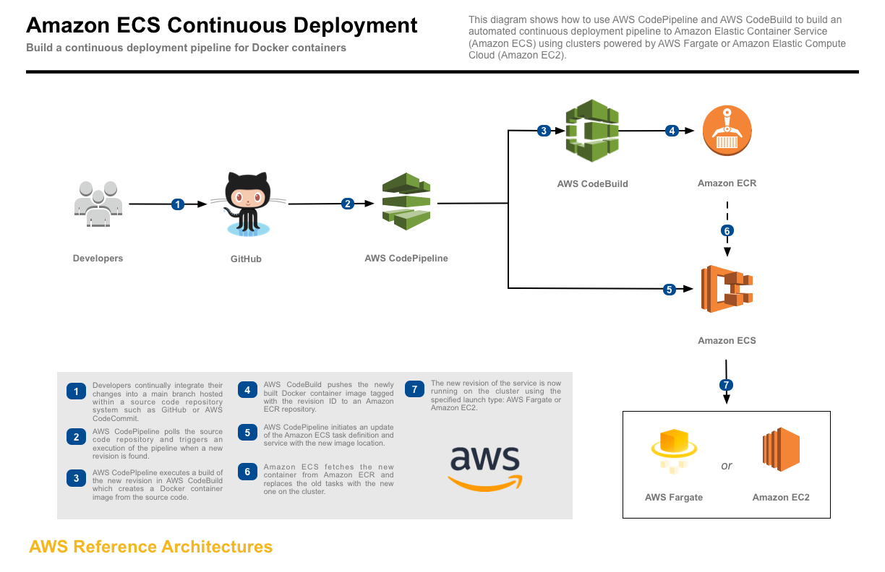

Introduction
==================================================

You have a simple Spring Boot app responding “hello” to requests. Making it scalable, secure, and available in
multiple AWS regions is part of the job. You have the whole AWS stack to automate it; put this app in the
cloud, launch it and secure it. During the process, you are expected to identify risks and come up with
recommendations to improve the security posture of the app and infrastructure.

For this assignment, deployment in multiple availability zones is sufficient but you can also try spreading the
app in multiple regions.

Assignment
-----------

1. Start the app in at least 3 availability zones. You are free to select the most secure solution to
accomplish this.
2. Each app instance should be provisioned in such a way that hitting the /hello URL displays the
availability zone on which the app is located.
3. Load balance the requests across all availability zones. Forty-two hits to the load balancer will give at
least one response from each availability zone.
4. Terminating an instance within the AZ should trigger the creation of another instance in the same AZ,
but the availability of the service shouldn’t be interrupted.
5. Implement security best practices for app and infrastructure.


Consider
---------------

- Protecting sensitive credentials
- Minimizing the impact if an attacker should break through the app

Deliver
------------------

1. A project hosted in an accessible location (GitHub is fine) with some instructions on how to run and a
small description of what it does.
2. A (short) list of risks identified in the source of commit of the app.
3. A recommendation to improve the security of the app or infrastructure in your project.


About this solution
--------------------

I made a modification to the Java controller source code to call EC2 metadata URL, so when you hit /hello and return the backend AZ from behind the ALB to the client for the purpose of this assignment. 

The decision on the deployment strategy came from the following considerations:
- Protecting sensitive credentials -> there is no direct access configured to the back-ends. The ECS cluster assigns tasks to back-ends via an IAM role assigned to the task. However, if more security is needed in the future, Amazon ECS enables you to inject sensitive data into your containers by storing your sensitive data in either AWS Secrets Manager secrets or AWS Systems Manager Parameter Store parameters [via these steps](https://docs.aws.amazon.com/AmazonECS/latest/developerguide/specifying-sensitive-data.html) and then referencing them in your container definition. 
- Minimizing the impact if an attacker should break through the app -> the app is dockerized and deployed through CI/CD pipeline to ECS cluster with ALB/Auto-scaling which programmatically assigns the tasks to back-ends. If an attacker should break through the app, it can only affect that docker container, which can be re-deployed through CI/CD pipeline to a different ECS backend insntace. 

You can also use the Amazon EC2 Run Command feature to securely and remotely manage the configuration of your Amazon ECS container instances. Run Command provides a 
way of performing common administrative tasks without having to log on locally to the instance. You can manage configuration changes across your clusters by simultaneously executing commands on multiple container instances. [Run command reports status and result for each command](https://docs.aws.amazon.com/AmazonECS/latest/developerguide/ec2-run-command.html).

Furthermore, App was scanned with a app.snyk.io utility and has [5 high severity vulnerabilities](https://github.com/afrovera/simple-app/tree/master/report) due to the outdated Spring framework version. Specifying version 2.0.8. in pom.xml patched it.

Future consideration is to integrate static code analysis into the CodePipeline stages during the releases to scan for vulnerabilities before deployments take place, and make use of Amazon Inspector for the projects running on EC2.

Steps to deploy
------------------

These steps assume that you have AWS credentials with minimum required privileges to deploy the stack. The number of services deployed by this project requires very broad IAM permissions, I recommend using MFA-protected IAM use/role with such policy.

Launching this AWS CloudFormation stack provisions a continuous deployment process that uses AWS CodePipeline to monitor a GitHub repository for new commits and AWS CodeBuild to create a new Docker container image and to push it into Amazon Elastic Container Registry (Amazon ECR).

When creating this stack, you can opt to deploy the service onto AWS Fargate or Amazon EC2. AWS Fargate allows you to run containers without managing clusters or services. If you choose Amazon EC2, an Auto Scaling group of t2.micro instances will be created to host your service.



#### 1. Fork the GitHub repository

[Fork](https://help.github.com/articles/fork-a-repo/) the [sample-app](https://github.com/afrovera/simple-app) GitHub repository into your GitHub account.

From your terminal application, execute the following command (make sure to
replace `<your_github_username>` with your actual GitHub username):

```console
git clone https://github.com/<your_github_username>/simple-app
```

This creates a directory named `simple-app` in your current directory, which contains the code for the Amazon ECS sample app.

#### 2. Create the CloudFormation stack

Copy the [templates](https://github.com/afrovera/devsecops/tree/master/templates) folder to your own S3 bucket. Note, this should result in a folder your_bucket/templates with 6 CloudFormation tempaltes. Copy direct link to ecs-continuous-deployment.yaml template from your bucket. If deploying in multiple regions, create bucket in each region with matching /templates folder. Repeat deployment steps below for each region. 

In CloudFormation console (or via CLI) deploy ecs-continuous-deployment.yaml template by pasting the link in 'specify an Amazon S3 template URL' field. 

The CloudFormation template requires the following parameters:

Cluster Configuration

Launch Type: Deploy the service using either AWS Fargate or Amazon EC2. Selecting EC2 will create an Auto Scaling group of t2.micro instances for your cluster. This simple-app solution was tested with Amazon EC2. See the documentation to learn more about launch types.

GitHub Configuration

Repo: The repo name of the sample service.
Branch: The branch of the repo to deploy continuously.
User: Your username on GitHub.
Personal Access Token: Token for the user specified above. (https://github.com/settings/tokens)

The CloudFormation stack provides the following output:

ServiceUrl: The sample service that is being continuously deployed.

PipelineUrl: The continuous deployment pipeline in the AWS Management Console.

Optional extra
------------------
 -- Request an Amazon-issued SSL certificate for securing the website in 2 regions (replace www.example.com with actual domain name).

```console
aws acm request-certificate --domain-name example.com --validation-method DNS --subject-alternative-names www.example.com --region us-east-1
```
```console
aws acm request-certificate --domain-name example.com --validation-method DNS --subject-alternative-names www.example.com --region eu-west-1
```

[Validate Certificate](https://docs.aws.amazon.com/acm/latest/userguide/gs-acm-validate-dns.html#gs-acm-use-dns) by creating CNAME record for the domain and wait for certificate to be issued (approximately 5 minutes with Route 53).

If you canont update DNS records for the domain, use e-mail validation.

```console
aws acm request-certificate --domain-name example.com --validation-method EMAIL --subject-alternative-names www.example.com --region us-east-1
```
```console
aws acm request-certificate --domain-name example.com --validation-method EMAIL --subject-alternative-names www.example.com --region eu-west-1
```

 -- Deploy Cloudfront Web distribution with 2 custom origins of ALB FQDN's, associate ACM certifiate and WAF ACL with it. Add your domains that was on the SSL certificate (such as example.com and www.example.com) to Alternative Domain Names (CNAMEs). Select origin behavior policy Redirect HTTP to HTTPS for each origin. Leave origin settings as default.

-- Deploy AWSRoute 53 hosted zone with latency based routing record sets for 2 ALB environments in 2 regions. Detailed steps:
https://docs.aws.amazon.com/Route53/latest/DeveloperGuide/resource-record-sets-values-failover-alias.html
https://docs.aws.amazon.com/Route53/latest/DeveloperGuide/resource-record-sets-values-latency-alias.html 

 -- Deploy [AWS WAF Security Automations](https://github.com/afrovera/aws-waf-security-automations/tree/master/deployment) in 2 regions. 

 -- Deploy [Threat detection stack](https://github.com/afrovera/aws-scaling-threat-detection-workshop/tree/master/templates) in 2 regions. 

 -- Deploy [AWS CIS Benchmark stack](https://github.com/afrovera/quickstart-compliance-cis-benchmark/tree/master/templates) in 2 regions.

Steps to test
------------------

1. The application contacts EC2 Metadata URL and returns an availability zone from the backend instance. Each time the app responds with "hello" and back-end AZ. Test by performing GET against the /hello endpoint.
2. The application is spread across 2 AWS regions. It is possibleto test this multi-regional failover by associating 2 ALB FQDN's with a domain in Route 53. Test by performing GET against /hello endpoint of a domain from different regions from an EC2 instance in each region. The app will return "hello" and AZ of the closest region.
3. Terminate an instance within the AZ. This will trigger the creation of another instance in the same AZ, but the availability of the service shouldn’t be interrupted. Bonus: use a tool such as [Chaos monkey](https://github.com/Netflix/chaosmonkey) to automatically invoke fault tolerance tests.
4. Inspect AWS Inspector reports and follow the remediation suggestions. 

ECS instances based on Amazon Linux with [preinstalled SSM agent](https://aws.amazon.com/about-aws/whats-new/2017/10/the-amazon-ec2-systems-manager-agent-is-now-pre-installed-on-amazon-linux-amis/). Use SSM agent to install and configure Inspector agent on ECS-tagged instances.

```console
aws ssm send-command --document-name "AmazonInspector-ManageAWSAgent" --parameters commands=["echo helloWorld"] --targets "Key=Name,Values=my_ecs_hosts"
```

After execution of the above, create resource group, assessment template and run it.

```console
aws inspector create-resource-group --resource-group-tags key=Name,value=my_ecs_hosts
```
```console
aws inspector create-assessment-target --assessment-target-name ExampleAssessmentTarget --resource-group-arn arn:aws:inspector:us-west-2:123456789012:resourcegroup/0-AB6DMKnv
```
```console
aws inspector create-assessment-template --assessment-target-arn arn:aws:inspector:us-west-2:123456789012:target/0-nvgVhaxX --assessment-template-name ExampleAssessmentTemplate --duration-in-seconds 180 --rules-package-arns arn:aws:inspector:us-west-2:758058086616:rulespackage/0-9hgA516p --user-attributes-for-findings key=ExampleTag,value=examplevalue
```
```console
aws inspector start-assessment-run --assessment-run-name examplerun --assessment-template-arn arn:aws:inspector:us-west-2:123456789012:target/0-nvgVhaxX/template/0-it5r2S4T
```
To perform application and network security testing with third-party tools, use an authorized platform to simulate attacks. This should generate GuardDuty findings and WAF metrics.

5. Evaluate audits of CIS Config rules for account-wide compliance.

Fixing immediate issues
------------------------

For webapp: Upgrade Spring and Tomcat on GitHub and re-test source-code. Release the change in CodeDeploy. Re-test the back-end instances with Inspector. Implement static code analysis in CodePipeline stages. Schedule Inspector runs. 

For AWS environment: reverse engineer IAM policies and implement least privilege by scoping down all permissions to required resources only where possible. Fix all other issues detected by CIS Config rules in the account. 

What Should I Do Before Running My Project in Production?
---------------------------------------------------------

You should regularly apply patches and review security best practices for the dependencies used by your application. Use these security best practices to update your sample code and maintain your project in a production environment:

1. Track ongoing security announcements and updates for your framework.
2. Before you deploy your project, follow the best practices developed for your framework.
3. Review dependencies for your framework on a regular basis and update as needed.
4. Follow the recommendations for your compliance framework on regular basis and implement best practices for your environment.
5. Continuously monitor the environment for any anomalies with the SIEM tools.
